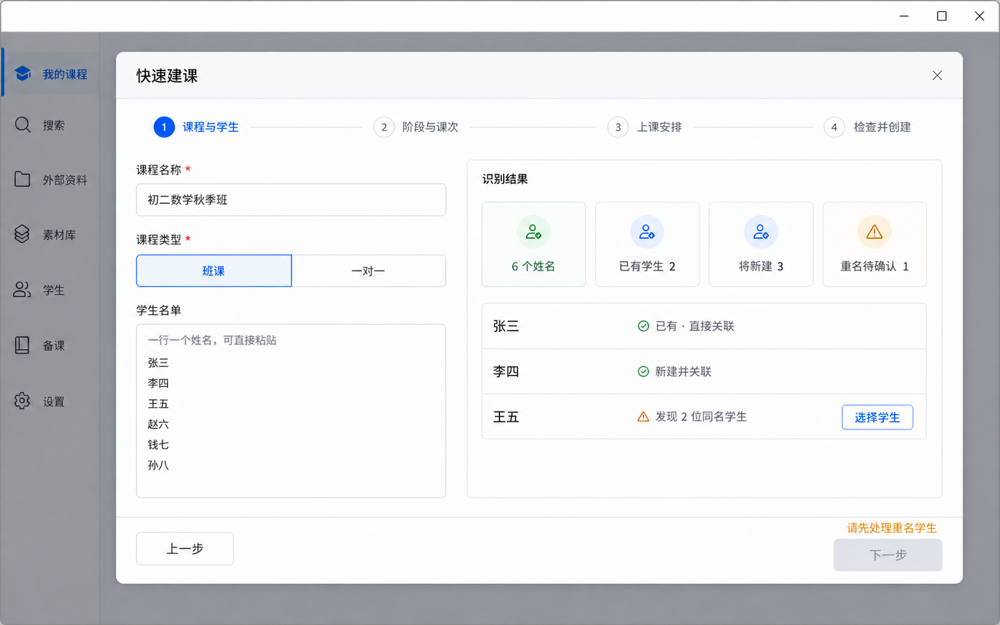
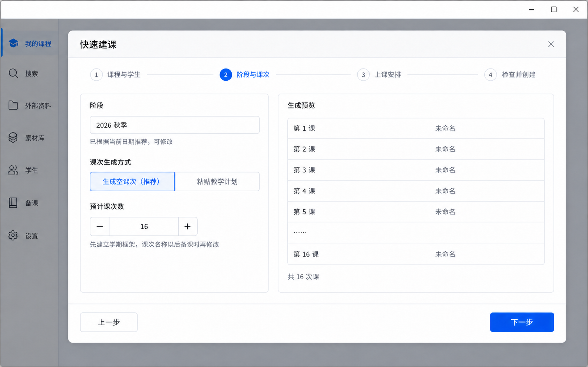
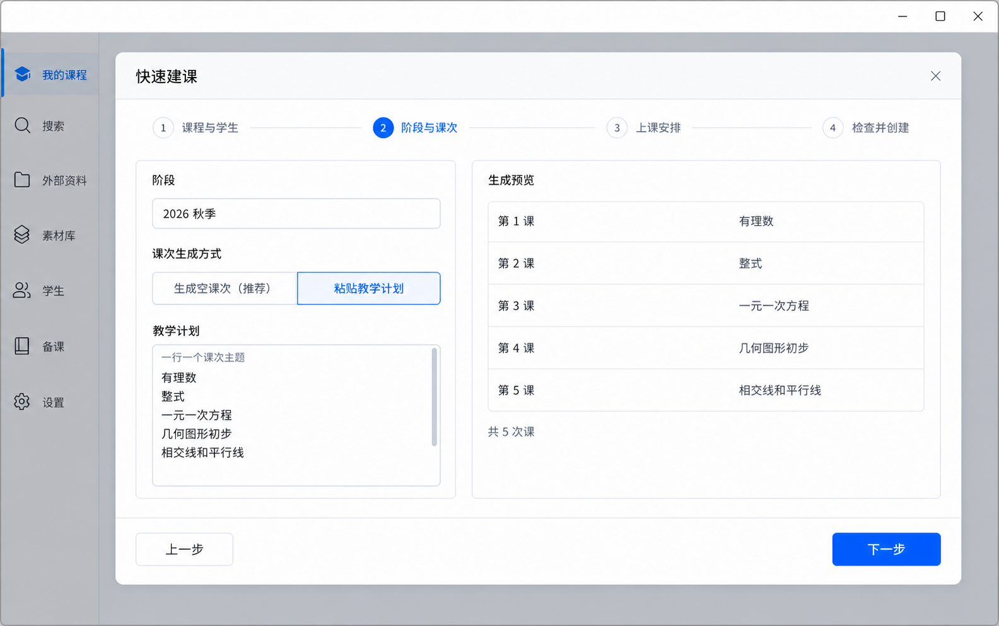
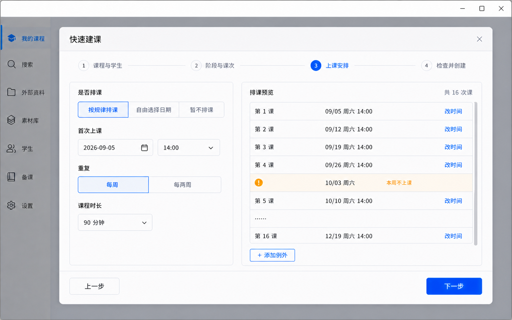
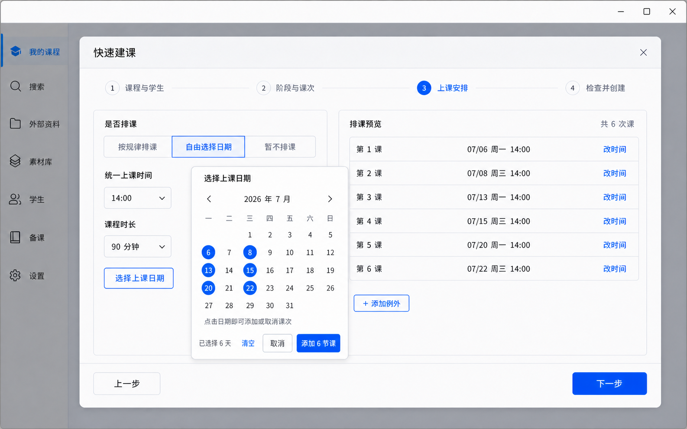

# 教师工作台 V1.3「快速建课」产品与实施方案

**日期：** 2026-08-24

**基线：** `checkpoint-V1.2-pass`

**状态：** 产品负责人已确认，作为 V1.3 冻结产品基线

**定位：** 不重构 V1.2 课程、学生、阶段、课次、点名和备课模型；增加面向老师真实意图的批量初始化编排层。

## 1. 结论

V1.2 的核心模型没有方向性问题。当前痛点来自创建入口严格暴露了实体顺序：老师必须分别创建学生、课程、阶段、课次和时间。V1.3 应增加一条四步向导，一次完成课程框架初始化，同时保留所有现有单项维护入口。


核心原则：

- 正常规律批量生成，异常情况逐节调整；
- 快速建课只生成计划，不确认任何课次已经上过；
- 排课日期与 Current Lesson、实际上课确认继续彼此独立；
- 最终创建必须是一个 Main / Service 事务，任一步失败不留下半成品；
- 现有“新建学生 / 新建阶段 / 新建课次 / 设置时间”继续用于后期维护。

## 2. 入口

课程页把 `+ 快速建课` 作为主入口；原来的轻量课程创建收进相邻的“更多”菜单，命名为“仅创建课程”。这样高频初始化不多一次模式选择，低频维护能力也没有丢失。


## 3. 四步向导

### 3.1 课程与学生

同一屏录入课程名称、课程类型和学生名单。班课支持一行一个姓名直接粘贴；一对一只允许解析出一位学生。

名单解析规则：

1. 去除每行首尾空白，忽略空行；
2. 本次粘贴中完全相同的姓名只保留一项，并提示重复行；
3. 与活动学生姓名精确匹配 0 位：标记“新建并关联”；
4. 精确匹配 1 位：标记“已有，直接关联”；
5. 精确匹配多位：必须由老师选择已有学生，或明确创建新的同名学生；
6. 不使用模糊匹配自动合并，避免把不同学生误关联；
7. 已软删除学生不自动恢复或关联。

只要仍有任意“重名待确认”，第一步的“下一步”按钮必须禁用，并在按钮旁提示“请先处理重名学生”。不得允许未解析学生进入后续步骤或最终请求。



同名选择只使用产品当前已经拥有的信息辅助辨认：在读 / 历史课程关系与最近人工学习记录日期。不为此扩展手机号、学校、家长或画像字段。


#### 学生档案与课程谁先？

产品不应强制唯一顺序，两条路径都必须成立：

- 已有学生档案：创建课程时直接选择并关联；
- 只有一份名单：在快速建课中粘贴姓名，系统在同一个事务里创建新学生档案、创建课程并建立关系；
- 名单暂未确定：允许先创建课程，显示“未关联学生”，以后再从课程学生区关联；
- 先在学生页建档：也可以稍后从课程学生区选择该学生。

因此“学生必须提前去学生页创建”不应成为课程创建的前置条件。数据层内部仍然需要先拿到 student ID 才能写入 `course_students`，但这是事务内部顺序，不是老师需要感知的操作顺序。

班课和一对一都允许暂时没有学生；一对一任何时刻最多只能有一位在读学生。没有学生时可以继续建课和备课，但点名保存必须禁用并明确提示。

### 3.2 阶段与课次

阶段名称只做可编辑的软推荐：

- 2–7 月：`当年 春季`；
- 8–12 月：`当年 秋季`；
- 1 月：`上一年 秋季`。

课次提供两种互斥模式。

模式 A 适合老师只知道学期大致课次数的情况。输入数量后生成 `第 N 课 · 未命名`。当前 `nodes.title` 不允许空字符串，因此实际标题使用“未命名”，显示编号仍按 V1.2 的阶段内排序动态计算。

预计课次数固定为 `1–100`。超过 100 时拒绝继续并提示：

> 一次最多创建 100 节课，请拆分阶段。



模式 B 适合已有教学计划的老师。一行一个主题，系统按输入顺序生成课次并给出编号预览。

教学计划忽略空行，最多解析 100 个有效非空主题。超过 100 时使用同一提示拒绝继续，不截断、不静默丢弃后面的主题。



快速建课至少创建一个阶段和一个课次；只想先建课程的用户使用“仅创建课程”。

### 3.3 上课安排

排课是可选步骤，提供三种正式模式：

- 按规律排课；
- 自由选择日期；
- 暂不排课。

规律或日历选择都只用于本次向导生成显式日期，不持久化成复杂 recurrence / calendar 模型。

支持：

- 每周；
- 每两周；
- 在弹出的月历中多选不连续日期；
- 预览所有生成日期；
- 排除某一周，但不删除课次；
- 单独修改某一课的日期和时间；
- 单独清空某一课的时间。

日期应按 Windows 本地日历逐周计算，再逐项转成 UTC ISO 8601；不要简单给 UTC 时间增加 `7 * 24h`，以免在有夏令时的系统上改变本地上课时刻。

排除某个日期后，未排的课次顺延映射到下一个有效日期。例如排除 10 月 3 日后，第 5 课使用 10 月 10 日，16 节课仍全部获得日期。

规律排课只保留“每周 / 每两周”。V1.3 不提供“不重复”：单节课程时间可以在创建后通过现有“设置时间”完成，自由选择日期已经覆盖不规则批量日期，暂不排课覆盖尚未决定时间的情况。



#### 自由选择日期

自由选择日期主要服务寒暑假集训、考前加课等不规则场景：

1. 老师先设置统一上课时间和课程时长；
2. 点击“选择上课日期”弹出月历；
3. 点击日期即选中，再点一次取消；
4. 选中几个日期，按钮就显示“添加 N 节课”；
5. 确认后按日期、时间升序生成排课预览，仍可逐节改时间。



自由选日期与第二步课次数的关系必须明确：

- 第二步为“生成空课次”时，默认让选中日期数同步课次数。例如选 6 天，就生成 6 个未命名课次；覆盖原数量前显示一次确认；
- 第二步为“粘贴教学计划”时，日期按顺序与教学主题配对；数量不一致时不得静默删除主题，必须提示老师继续选日期，或明确选择“保留剩余未排课课次”；
- V1.3 首版一个日期默认对应一节课；如后续确认同一天上午、下午多节是高频需求，再增加“同日再加一节”，不为首版扩大交互。

课程时长保留在 V1.3 UI，并且必须持久化。V1.3 只增加一个很小的 schema 增量，不增加 course 级默认时长：

```sql
ALTER TABLE lesson_sessions
  ADD COLUMN duration_minutes INTEGER
  CHECK (duration_minutes IS NULL OR duration_minutes > 0);
```

`lesson_sessions` 的写入条件固定为：

```text
scheduledAt !== null || durationMinutes !== null
```

因此允许同时存在：

```text
scheduled_at = NULL
duration_minutes = 90
```

例如选择“暂不排课”但课程时长为 90 分钟时，生成的每个 lesson 仍 UPSERT 一行 `lesson_sessions`，只保存 `duration_minutes`。时长不依赖是否已经安排日期，也不需要另建 course 级默认时长字段。

### 3.4 检查并创建

最后一步汇总课程、学生解析、阶段、课次、日期和例外；每块都能返回对应步骤修改。

上课安排摘要固定支持三种状态：

1. 全部已排：显示 `16/16 节已排`，再显示规律或自由日期摘要、时长、例外与首末日期；
2. 部分已排：显示 `10/16 节已排 · 6 节未排`，再显示已有日期摘要和“未排课次可在创建后继续设置时间”；
3. 完全未排：显示“暂未安排上课时间”和 `0/16 节已排 · 16 节未排`；即使日期为空，已经填写的课程时长仍正常显示。

必须明确告诉老师：

- 第 1 课会成为 Current Lesson；
- 所有课次的 `taught_confirmed_at` 仍为空；
- 排课只写入 `scheduled_at`，不会推进教学进度；
- 创建是一个事务，失败不会留下部分学生或半门课程。

全部已排：


部分已排：


完全未排：


## 4. 创建后的结果

成功后关闭向导，自动选中新课程，在原课程详情中显示完整阶段、课次和时间；顶部使用可关闭的成功提示，不再弹一个阻断式“完成”对话框。主动作直接进入第 1 课备课。


## 5. 推荐的技术边界

### 5.1 对外只增加一个编排接口

不建议 Renderer 连续调用几十次现有 IPC。那会造成部分成功、恢复困难和大量刷新。预览可以完全在 Renderer 中完成，最终写入从第一版开始就使用一个严格白名单接口：

```ts
createCourseSetup(request: CreateCourseSetupRequest): Promise<CreateCourseSetupResult>
```

请求应携带老师已经确认的明确结果，而不是让 Main 再猜名字：

```ts
interface CreateCourseSetupRequest {
  title: string
  mode: 'class' | 'one_to_one'
  students: Array<
    | { type: 'existing'; studentId: string }
    | { type: 'new'; name: string }
  >
  periodTitle: string
  lessons: Array<{
    title: string
    scheduledAt: string | null
    durationMinutes: number | null
  }>
}
```

重复规则、日历多选状态和例外不需要进入 Main；Renderer 预览后提交每个 lesson 的最终显式 UTC 时间。Main 不信任 Renderer 的旧预览，并在事务内执行以下校验：

- 所有 `{ type: 'new', name }` 再次 `trim()`；trim 后必须非空，且长度为 `1–100` 个 Unicode 字符；
- 所有 `{ type: 'existing', studentId }` 再次查询并确认学生仍存在、未软删除；
- existing studentId 不得重复，new name 在本次请求中按 trim 后精确值去重；
- lessons 数量必须为 `1–100`，所有标题 trim 后非空；
- 所有 `scheduledAt` 必须为有效 UTC ISO 8601；所有非空 `durationMinutes` 必须为正整数；
- 继续验证课程模式、一对一最多一位、父子关系与最终 Current Lesson 合法性。

### 5.2 一个事务内完成

推荐的事务顺序：

```text
校验完整请求
→ 创建明确标记为 new 的学生
→ 创建课程
→ 建立学生关系
→ 创建阶段
→ 按顺序创建课次
→ 对 scheduledAt !== null 或 durationMinutes !== null 的课次 UPSERT lesson_sessions
→ 设置 active_period_id 与第 1 课 current_lesson_id
→ 提交
```

`scheduled_at = NULL`、`duration_minutes = 90` 是合法的 session 扩展状态。任何学生、课程、关系、阶段、课次、session 或 Current Lesson 写入失败，整个事务回滚。

不要把 `batchCreateStudents()`、`batchCreateLessons()`、`batchScheduleLessons()` 都暴露成新的 Renderer IPC。它们可以是 Main 内部帮助函数，但用户动作只有一个事务边界。

### 5.3 复用现有能力

- 继续使用 `NodeService` 的 course / period / lesson 语义与 sort_order；
- 继续使用 `course_students`，不引入复杂 enrollment 历史；
- 继续使用 `lesson_sessions.scheduled_at` 和 V1.2 本地时间转换规则；
- 继续使用 `course_progress`，只初始化 Active Period 和 Current Lesson；
- 不改 LessonPrepContext、DraftService、ManagedFileService、Search、Parser、AI 或 Backup 的产品语义；
- 现有逐项创建和设置时间接口原样保留。

## 6. 需要防住的边界

- 一对一最多关联一位在读学生；一对一和班课都可以暂时为空，但必须明显提示点名暂不可用；
- 单次快速建课最多创建 100 节课；数量输入和教学计划有效非空主题都使用同一上限，超过即拒绝并提示拆分阶段；
- 同一次请求中不得出现重复 existing studentId；
- 同一次请求中的 new 姓名去重后再写入；
- 所有 lesson title 必须非空，空课次统一写入“未命名”；
- `scheduledAt` 必须为有效 UTC ISO 8601，规律排课和自由选日期的映射不得重复或错位；`scheduledAt` 为空但 `durationMinutes` 非空时仍必须创建 session 扩展行；
- 关闭向导前如有内容，提示是否放弃；V1.3 首版无需持久化未完成向导；
- 创建成功只初始化 Current Lesson，不写点名、不确认已上、不结束课程；
- 创建失败返回可定位到步骤的错误，并保持向导输入可修改重试。

## 7. 冻结的 V1.3 实施切片

1. `V13-01`：schema v13、`createCourseSetup` contract、Preload、安全 IPC 和单事务 Service；
2. `V13-02`：名单解析、阶段推荐、课次生成、本地日历排课和确认摘要 view model；
3. `V13-03`：向导容器、课程与学生、阶段与课次前两步 UI；
4. `V13-04`：三种排课、自由日期月历、确认页、课程页入口和创建结果完整接入；
5. `V13-05`：全量测试、typecheck、lint、production build、diff check、安全审计和代表性 Windows 流程。

专项测试必须覆盖：未解决重名禁用下一步、同名、新建 / 已有混合、new.name Main 二次校验、existing.studentId 事务内失效、先课程后学生、一对一空课程与最多一位限制、1/100/101 课次边界、教学计划 100/101 个有效主题、无排课但持久化 duration、每周 / 每两周、自由多选日期、课次和日期数量不一致、全部 / 部分 / 未排摘要、排除与改单节、UTC、本地跨日、事务回滚和 Current Lesson 独立性。

## 8. 本版明确不做

- 独立的月 / 周排课日历页面（快速建课里的多选日期器除外）；
- 节假日数据库和自动顺延；
- 提醒、通知、签到、成绩分析；
- 拖拽排课；
- 永久 recurrence 规则和复杂 series 编辑；
- 多 session；
- 学生画像与联系方式；
- 新 AI 工作流；
- 重做现有备课内核。
